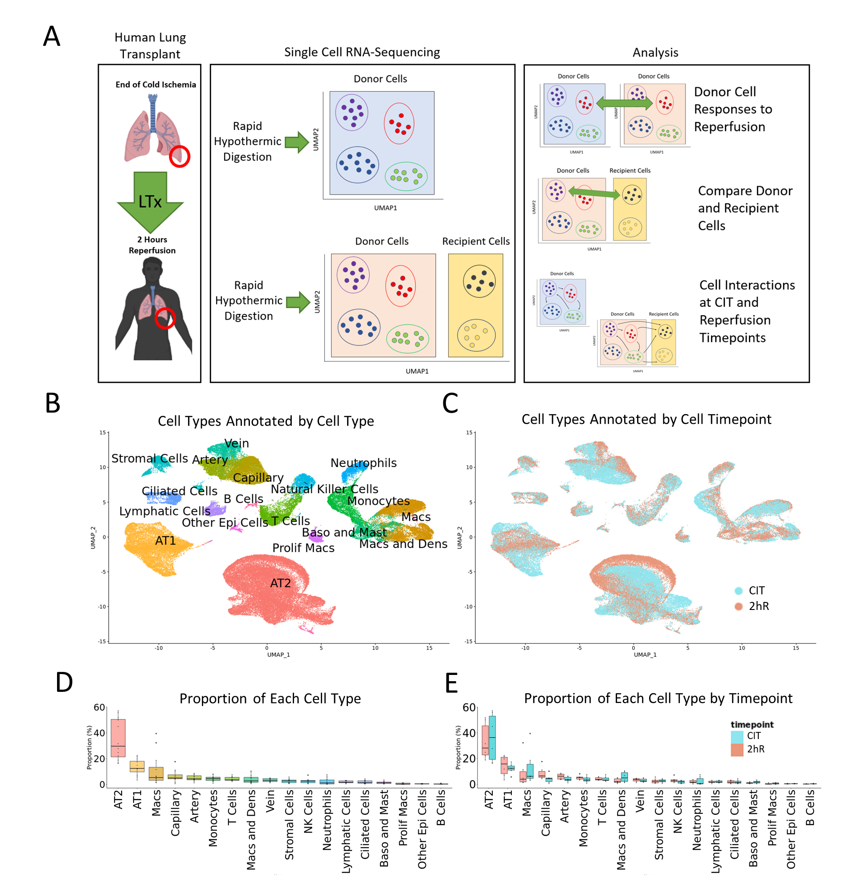

# [Mapping Inflammatory Responses in Human Lung Transplants at Single Cell Resolution] (manuscript in preparation)

Aaron Wong, et al.

Manuscript in preparation. A portion of the code used for analysis is published here. 

## Abstract

Ischemia reperfusion is an unavoidable step of organ transplantation. Development of therapeutics for lung injury during transplantation has proved challenging; understanding lung injury from human data at the single cell resolution is required to accelerate the development of therapeutics. Donor lung biopsies from six human lung transplant cases were collected at the end of cold preservation and 2-hour reperfusion and underwent single cell RNA sequencing. Donor and recipient origin of cells from the reperfusion timepoint were deconvolved. Gene expression profiles were (1) compared between each donor cell type between timepoints and (2) compared between donor and recipient cells. Inflammatory responses from donor lung macrophages were found after reperfusion with upregulation of multiple cytokines and chemokines, especially IL-1 and IL-1. Significant inflammatory responses were found in alveolar epithelial cells (featured by CXCL8) and lung endothelial cells (featured by IL-6 upregulation). Different inflammatory responses were noted between donor and recipient monocytes and CD8+ T cells. The inflammatory signals and differences between donor and recipient cells observed provide insight into the cellular and molecular mechanisms of ischemia reperfusion induced lung injury. Further investigations may lead to the development of novel targeted therapeutics.

